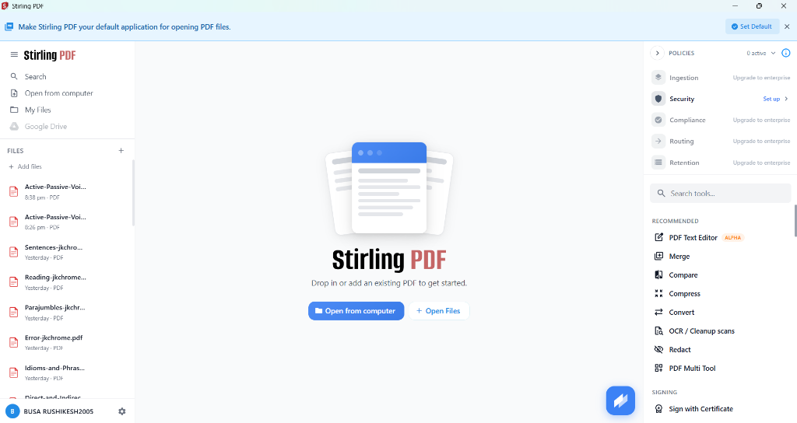

# OmniDoc Studio 🚀
### Enterprise-Grade Scanned PDF to Word (DOCX) AI Extractor & Stirling-PDF Suite

[](LICENSE)
[](https://www.python.org/)
[](https://github.com/PaddlePaddle/PaddleOCR)
[](https://openrouter.ai/)
[](https://github.com/Stirling-Tools/Stirling-PDF)
[](https://microsoft.com)

> **OmniDoc Studio** is a modern, high-performance desktop workstation combining neural Optical Character Recognition (OCR), multimodal Large Language Models (LLMs), and an offline native **Stirling-PDF** manipulation suite. It converts blurry, skewed, and degraded scanned PDFs into formatted, editable Microsoft Word (`.docx`) documents while providing offline PDF tools (Split, Merge, Rotate, Compress, Unlock, and Metadata Editing).

---

## 💾 Instant Download (Windows Standalone Setup)

[-2ea44f?style=for-the-badge&logo=windows)](https://github.com/rushikin/OmniDoc-Studio/releases/latest)

> 📦 **Single Downloadable Setup File**: Download [`OmniDocStudio_v2.4_Setup.zip`](https://github.com/rushikin/OmniDoc-Studio/releases/latest) from the **[GitHub Releases](https://github.com/rushikin/OmniDoc-Studio/releases)** page. Includes the full offline PaddleOCR engine, PyWebView workstation UI, and Stirling PDF tools — ready to run with zero installation or Python dependencies needed!

---

## 📸 Workstation Preview



---

## 🌟 Key Features

### 🧠 1. Neural AI OCR & Document Reconstruction
- **Deep Layout Analysis**: Powered by **PaddleOCR 3.x** for paragraph clustering, table detection, and reading-order reconstruction.
- **Adaptive Image Preprocessing**: Automatic CLAHE contrast enhancement and Hough transform deskew (±10° angle auto-rotation) for faded or tilted document scans.
- **LLM Contextual Gap-Filling**: Uses OpenRouter models (e.g. Gemini 2.0 Flash, Llama 3.3 70B, DeepSeek V3, Mistral) to reconstruct degraded glyphs, broken grammar, and corrupted tables.
- **Polished Word Synthesis**: Generates native `.docx` files with automated Table of Contents (TOC), "Page X of Y" dynamic footers, headers, and colored border tables.

### 🛠️ 2. Stirling-PDF Native Toolkit (Offline)
Inspired by Stirling-PDF's web architecture, rewritten into native, lightweight, zero-Docker Python/pikepdf tools:
- **PDF Splitter**: Interactive visual page splitter and range extractor.
- **PDF Merger**: Sequence ordering and combining of multiple documents.
- **Page Operations**: Rotation (90°/180°/270°), page deletion, page reordering.
- **Security & Privacy**: AES-256 password protection and removal.
- **Optimization & Clean-up**: Fast web linearization, stream compression, and metadata editing.

### 💻 3. Dual UI Workstation
1. **Modern Workstation UI (`python run_ui.py`)**:
   - 3-column Stirling-inspired light interface.
   - Comprehensive micro-animation system (dynamic laser scanlines, elevation physics, click ripples, and live progress streaming).
   - Powered by `pywebview` with zero browser tab clutter.
2. **CustomTkinter Desktop GUI (`python gui_app.py`)**:
   - Native dark/light themed window with drag-and-drop file staging and live logs.
3. **Automated CLI & Batch Engine (`python main.py`)**:
   - Process single files or recursive directories of scans in batch mode.

---

## ⚡ Quick Start

### 1. Prerequisites
- **Python 3.10+** (64-bit recommended)
- **Poppler for Windows**:
  - Download from: [poppler-windows releases](https://github.com/oschwartz10612/poppler-windows/releases)
  - Extract to `C:\poppler\` (such that `C:\poppler\Library\bin\pdftoppm.exe` exists).

### 2. Installation
```powershell
# Clone the repository
git clone https://github.com/rushikin/OmniDocStudio.git
cd OmniDocStudio

# Install dependencies
pip install -r requirements.txt
```

### 3. Setup OpenRouter AI (Free Tier)
```powershell
copy .env.example .env
```
Add your free OpenRouter API key inside `.env`:
```env
OPENROUTER_API_KEY=sk-or-v1-your-key-here
OUTPUT_DIR=C:\Users\YourUser\OneDrive\Desktop\Extracted Files
```
*(Get a free API key with zero subscription fees at [openrouter.ai/keys](https://openrouter.ai/keys))*

### 4. Verify System Readiness
```powershell
python check_setup.py
```

### 5. Launch the Application
- **Option A — Modern Workstation (Micro-Animations & Visual Tools)**:
  ```powershell
  python run_ui.py
  ```
- **Option B — Native CustomTkinter GUI**:
  ```powershell
  python gui_app.py
  ```
- **Option C — CLI Mode**:
  ```powershell
  python main.py --input "my_scan.pdf"
  python main.py --batch "C:\folder_of_scans\"
  ```

---

## 📦 Building Standalone Windows Executable (.exe)

OmniDoc Studio can be compiled into a standalone Windows executable:
```powershell
python -m PyInstaller OmniDocStudio.spec --noconfirm
```
The output directory will be available at `dist/OmniDocStudio/OmniDocStudio.exe`.

---

## 🤝 Acknowledgements & Inspiration

OmniDoc Studio proudly builds upon and draws inspiration from several outstanding open-source projects:

1. **[Stirling-PDF](https://github.com/Stirling-Tools/Stirling-PDF)**:
   - Huge thanks to Anthony Stirling and the Stirling-Tools community.
   - OmniDoc Studio's 3-column workstation design, tool organization, and workflow philosophy are heavily inspired by Stirling-PDF's intuitive, privacy-first PDF utility suite.
2. **[PaddleOCR](https://github.com/PaddlePaddle/PaddleOCR)**:
   - For state-of-the-art layout analysis, deep learning-based text detection, and OCR recognition models.
3. **[pikepdf](https://github.com/pikepdf/pikepdf)**:
   - For ultra-fast, robust C++ QPDF Python bindings powering our native PDF toolkit.
4. **[OpenRouter](https://openrouter.ai/)**:
   - For providing open, low-latency unified access to state-of-the-art multimodal and language models.
5. **[CustomTkinter](https://github.com/TomSchimansky/CustomTkinter)** & **[pywebview](https://github.com/r0x0r/pywebview)**:
   - For modern, beautiful desktop window rendering engines.

---

## 📄 License

This project is licensed under the **MIT License** - see the [LICENSE](LICENSE) file for details.
